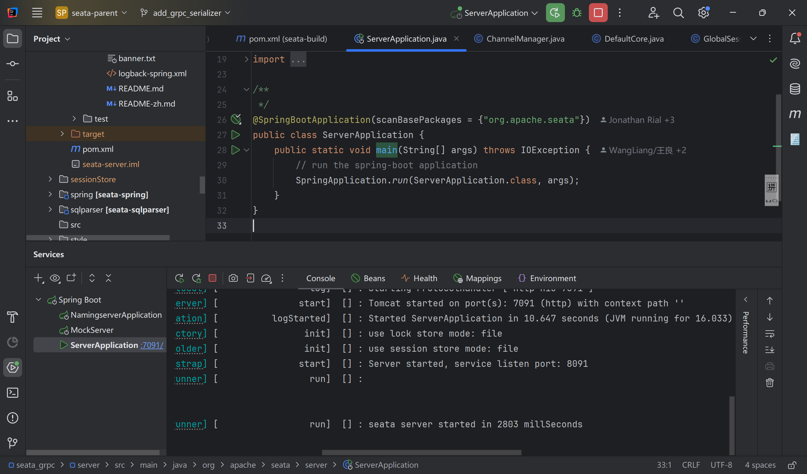
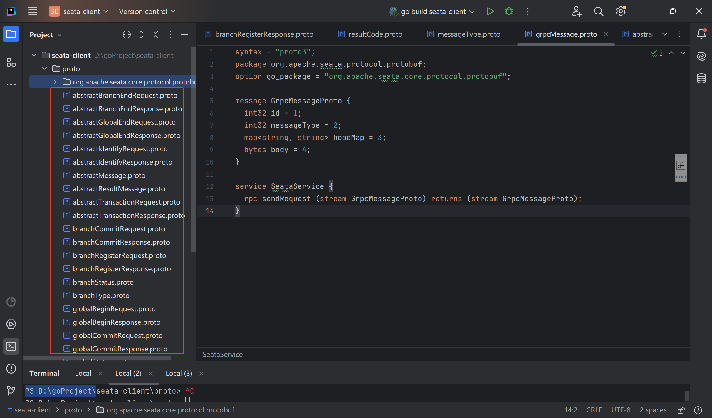
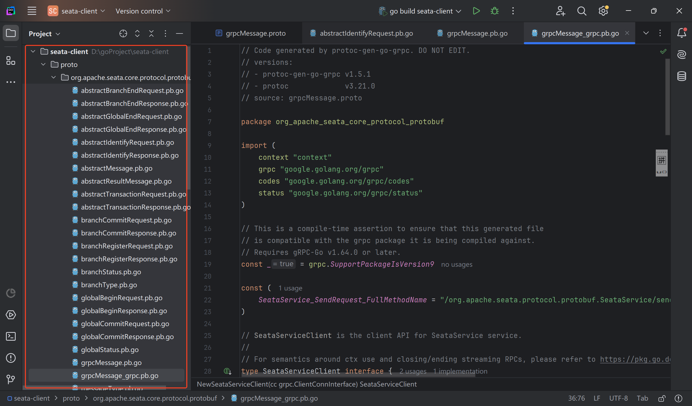
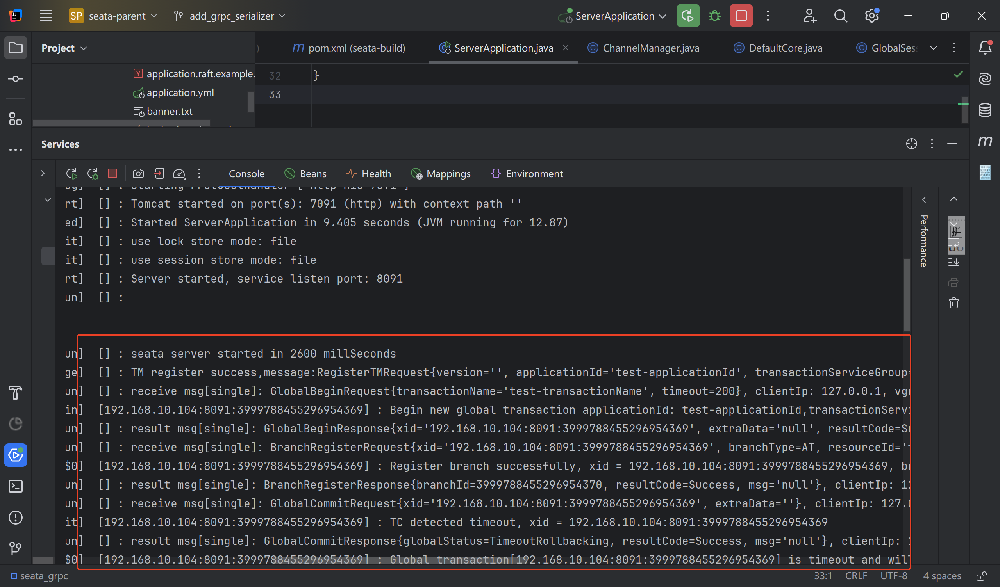
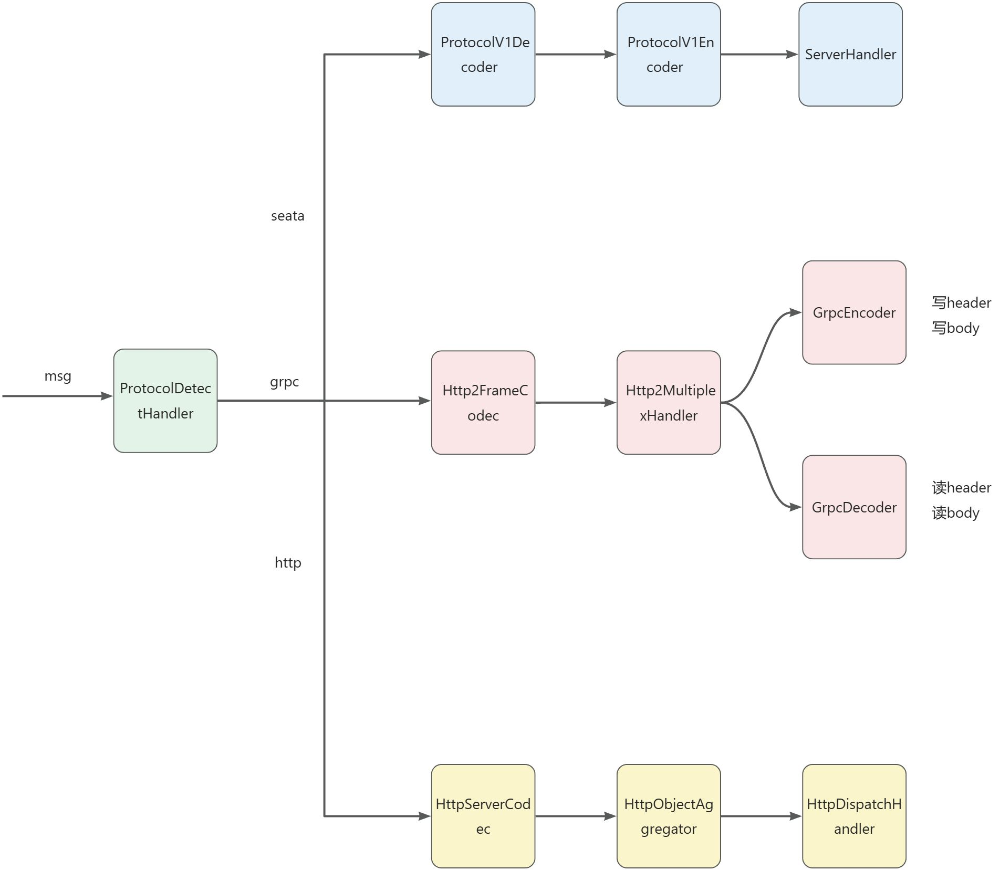

# Background
With the merge of PR [https://github.com/apache/incubator-seata/pull/6754](https://github.com/apache/incubator-seata/pull/6754), Seata Server is now capable of recognizing and processing Grpc requests. This means that any language client, by simply including the proto files, can communicate with the Seata Server deployed on the JVM, thereby achieving the full process of distributed transactions.

Below is a demonstration of this process using Go language as an example.

# Environment Preparation
Goland 2024.2

Idea 2024.3

JDK 1.8

Go 1.23.3

Seata 2.3.0-SNAPSHOT

libprotoc 3.21.0

# Operation Process
## Deploy and Start Seata Server
Run org.apache.seata.server.ServerApplication#main as shown below:



## Proto File Import
Import the necessary proto files for the transaction process in the Go project, including various transaction request and response proto files and the proto files for initiating RPC. As shown below:



## Grpc File Generation
In the directory where the proto files were imported in the previous step, execute the command:

```shell
protoc --go_out=. --go-grpc_out=. .\*.proto
```

After execution, the grpc code will be generated as shown below:



## Grpc Invocation
Complete a distributed transaction process in main.go and print the response from Seata Server. The code is as follows:

```go
func main() {
    conn, err := grpc.Dial(":8091", grpc.WithInsecure())
    if err != nil {
        log.Fatalf("did not connect: %v", err)
    }
    defer conn.Close()
    client := pb.NewSeataServiceClient(conn)
    stream, err := client.SendRequest(context.Background())
    if err != nil {
        log.Fatalf("could not sendRequest: %v", err)
    }
    defer stream.CloseSend()

    sendRegisterTm(stream)
    xid := sendGlobalBegin(stream)
    sendBranchRegister(stream, xid)
    sendGlobalCommit(stream, xid)
}

// ... Other functions ...

```

After running, the Seata Server console prints as follows:



The Go client console prints as follows:


# Implementation Principle
## Proto Design
To achieve communication with multi-language grpc clients, Seata Server defines grpcMessage.proto, which defines the GrpcMessageProto that assembles various Seata Message objects and the bidirectional stream interface sendRequest for assembling Seata communication requests. Seata Server uses grpcMessage.proto as a medium to achieve communication with multi-language clients.

```proto
syntax = "proto3";
package org.apache.seata.protocol.protobuf;
import "google/protobuf/any.proto";
option java_multiple_files = true;
option java_outer_classname = "GrpcMessage";
option java_package = "org.apache.seata.core.protocol.generated";

message GrpcMessageProto {
    int32 id = 1;
    int32 messageType = 2;
    map<string, string> headMap = 3;
    google.protobuf.Any body = 4;
}

service SeataService {
    rpc sendRequest (stream GrpcMessageProto) returns (stream GrpcMessageProto);
}
```

In addition, GrpcSerializer is defined, adapting to Seata's serialization SPI system, which is used to achieve the mutual conversion of protobuf byte streams and Seata message objects.

## Grpc Protocol Recognition
Seata Server implements ProtocolDetectHandler and ProtocolDetector. ProtocolDetectHandler, as a ByteToMessageDecoder, will traverse the ProtocolDetector list when receiving a message to find a ProtocolDetector that can recognize the current message. ProtocolDetector distinguishes Seata protocols, Http1.1 protocols, and Http2 protocols through recognizing magic numbers. Once recognized, the ChannelHandler capable of handling the protocol is added to the current Channel's Pipeline.



## Grpc Request Sending and Processing
Seata Server implements GrpcEncoder and GrpcDecoder. GrpcEncoder is responsible for converting Seata's RpcMessage into GrpcMessageProto recognizable by grpc native clients, filling the header with status, contentType, and other protocol headers for communication with grpc native clients. GrpcEncoder also adapts to grpc protocol specifications, writing the compression bit, length, and message body in the order specified by the grpc protocol into the channel.

GrpcDecoder is responsible for processing requests from grpc native clients. Since grpc clients implement request batching in the underlying transmission through a queue flush, GrpcDecoder is also responsible for unpacking a batch of requests. Finally, GrpcDecoder converts the protobuf byte stream into one or more RpcMessages and passes them to the Seata request processor.

## Grpc Connection Establishment and Management
On the server side, simply configure a ProtocolDetectHandler to complete the recognition and establishment of various types of connections.

```java
@Override
public void initChannel(SocketChannel ch) {
    ProtocolDetector[] defaultProtocolDetectors = {
            new Http2Detector(getChannelHandlers()),
            new SeataDetector(getChannelHandlers()),
            new HttpDetector()
    };
    ch.pipeline().addLast(new IdleStateHandler(nettyServerConfig.getChannelMaxReadIdleSeconds(), 0, 0))
            .addLast(new ProtocolDetectHandler(defaultProtocolDetectors));
}
```

On the client side, when obtaining a Channel, if the current communication method is Grpc, an Http2MultiStreamChannel is obtained as the parent Channel, and grpc-related handlers are added to this Channel.

```java
if (nettyClientConfig.getProtocol().equals(Protocol.GPRC.value)) {
    Http2StreamChannelBootstrap bootstrap = new Http2StreamChannelBootstrap(channel);
    bootstrap.handler(new ChannelInboundHandlerAdapter() {
        @Override
        public void handlerAdded(ChannelHandlerContext ctx) throws Exception {
            Channel channel = ctx.channel();
            channel.pipeline().addLast(new GrpcDecoder());
            channel.pipeline().addLast(new GrpcEncoder());
            if (channelHandlers != null) {
                addChannelPipelineLast(channel, channelHandlers);
            }
        }
    });
    channel = bootstrap.open().get();
}
```

Please note that due to network issues, the parsing of the above links was unsuccessful. If you need the content of the parsed web pages, please check the legality of the web page links and try again. If you do not need the parsing of these links, the question can be answered normally.
